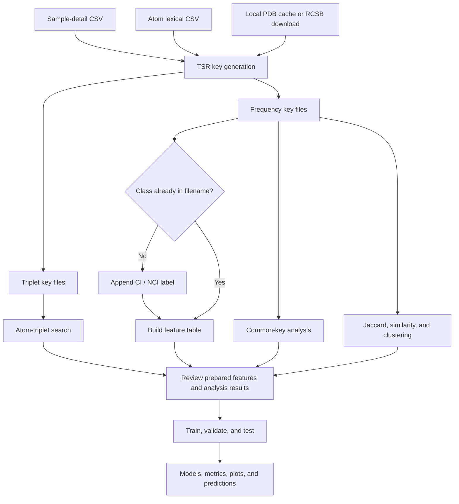

# Carbohydrate–Protein Triangular Spatial Relationship (TSR) Analysis

This project generates atom-triplet keys using the Triangular Spatial
Relationship (TSR) method for carbohydrate and protein structures, converts key
frequencies into feature tables, and trains classification models.

## Main workflow



Required execution order:

1. Prepare a sample-detail CSV and atom lexical map.
2. Provide cached legacy PDB files or allow the key generator to download them.
3. Generate triplet and frequency key files.
4. Add class labels when they are not already present, then combine frequency
   files into one feature table.
5. Run atom-triplet search, common-key analysis, Jaccard similarity, and
   clustering to analyze the generated structural features.
6. Train and evaluate one or more classifiers.

## Installation

Python 3.11 is recommended.

```bash
git clone https://github.com/KrishnaRauniyar/CarbohydratesTSR.git
cd CarbohydratesTSR

python3.11 -m venv .venv
source .venv/bin/activate
python -m pip install --upgrade pip
python -m pip install -r requirements.txt

mkdir -p data/pdb_cache data/processed data/keys data/features data/outputs
```

Run the commands below from the repository root.

## Input files

A ligand sample-detail CSV normally contains:

```csv
protein,chain,carb_name,carb_id,group
5WT9,G,NAG,102,CI
7PNB,Z,MAN,6,NCI
```

A residue sample CSV can use:

```csv
protein,chain,residue,seqnum,label
2V7A,B,ASP,391,NI
5WT9,G,ASN,58,CI
```

Key generation also requires a lexical CSV containing `atom` and `seq`
columns.

## Core workflow

### 1. Generate TSR keys

```bash
python key_generator/key_generation_using_id_chain_res_seq/key_triplets_generation_dual_mode.py \
  --input_path data/pdb_cache \
  --csv_file data/processed/sample_details.csv \
  --lexical_file data/atom_lexical.csv \
  --output_path data/keys \
  --summary_csv data/processed/key_summary.csv \
  --mode all_4_id_chain_res_seqnum \
  --entity_type ligand \
  --entity_name_column carb_name \
  --seqnum_column carb_id \
  --num_cores 8
```

This downloads missing legacy PDB files and creates:

```text
5WT9_G_102_NAG.keys_theta29_dist18
5WT9_G_102_NAG.keys_Freq_theta29_dist18
```

For amino-acid residues, use `--entity_type residue`. Use `--mode id_chain`
to generate one representation for an entire chain scope.

### 2. Add CI/NCI labels

Skip this step when key filenames already end with the correct class.

```bash
python src/data_generation/add_label_CI_NCI_tripletname/add_label_ci_nci_tripletname.py \
  --sample-csv data/processed/sample_details.csv \
  --input-protein-folder data/keys \
  --output-folder data/keys_labeled \
  --key-file-type frequency
```

Use `--dry-run` to preview the copied filenames.

### 3. Create the feature table

```bash
python key_generator/key_frequency/key_frequency_drug.py \
  --input-dir data/keys_labeled \
  --output-dir data/features \
  --header_bool yes
```

The result is:

```text
data/features/localFeatureVect_theta29_dist18_NoFeatureSelection_keyCombine0_header.csv
```

The identifier must end with the class label, for example
`5WT9_G_102_NAG_CI`. The ML scripts use the final underscore-separated token
as the label.

### 4. Train a model

Example using Random Forest:

```bash
python ai_ml/random_forest/train_random_forest_tsr.py \
  --input_csv data/features/localFeatureVect_theta29_dist18_NoFeatureSelection_keyCombine0_header.csv \
  --output_dir data/outputs/random_forest \
  --label_from "Protein Name" \
  --split_strategy pdb_grouped \
  --balance_method class_weight \
  --random_state 42
```

Available models:

| Model               | Directory                      |
| ------------------- | ------------------------------ |
| Deep Neural Network | `ai_ml/deep_neural_network/` |
| CatBoost            | `ai_ml/catboost/`            |
| LightGBM            | `ai_ml/lightgbm/`            |
| XGBoost             | `ai_ml/xgboost/`             |
| Random Forest       | `ai_ml/random_forest/`       |
| SVM                 | `ai_ml/svm/`                 |
| Logistic Regression | `ai_ml/logistic_regression/` |

Each directory contains `train_*_tsr.py` and `evaluate_*_tsr.py`. Add `--help`
to a training or evaluation command to view all model options.

Training outputs are organized under:

```text
OUTPUT_DIR/
├── config/
├── metrics/
├── models/
├── plots/
└── predictions/
```

## Additional utilities

| Task                                       | Script                                                                                                     |
| ------------------------------------------ | ---------------------------------------------------------------------------------------------------------- |
| Generate glycoprotein samples from RCSB    | `src/data_generation/glycoprotein_sample_generation/data_glycoprotein.py`                                |
| Filter structures without legacy PDB files | `src/data_generation/filterout_nolegacypdb_files/filterout_nolegacypdb_files.py`                         |
| Balance carbohydrate classes               | `src/data_generation/balance_sample_detail_with_min/balance_sample_detail_with_min.py`                   |
| Build discovery CI/NCI labels              | `src/data_generation/discovery_data/build_discovery_sample_details.py`                                   |
| Create CI/WCI/NCI labels from distances    | `src/data_generation/cross_keys_interaction_label_ci_wci_nci/cross_keys_interaction_label_ci_wci_nci.py` |
| Search keys for an atom triplet            | `src/data_generation/search_tsr_key/search_tsr_key.py`                                                   |
| Calculate common keys                      | `common_keys/common_keys.py`                                                                             |
| Convert distance to similarity             | `src/data_generation/distance_to_similarity/distance_to_similarity.py`                                   |
| Create a hierarchical clustermap           | `clusters/clustermap/clustermap.py`                                                                      |

The legacy Jaccard wrapper requires external MPI/HDF5 programs that are not
included in `requirements.txt`.

## License

This project is available under the [MIT License](LICENSE).
